# Fee Engine Flow Diagrams

Fee calculation and rule management flows for the fee-engine service.

---

## 1. Fee Calculation — Happy Path

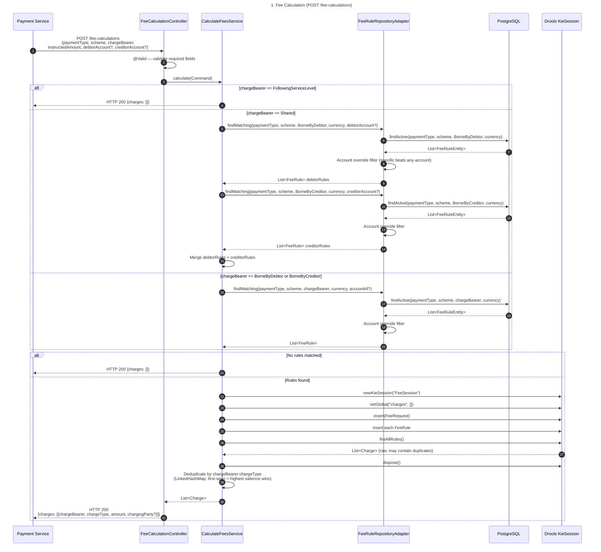

### Step Details

- **Step 1 — POST /fee-calculations:** Client (a payment service) sends the request with `paymentType` (e.g. `DOMESTIC`), `scheme` (e.g. `FPS`), `chargeBearer` (e.g. `BorneByDebtor`), an `instructedAmount` with `amount` and `currency`, and optional `debtorAccount` / `creditorAccount`. No authentication is required — this endpoint is covered by `calculationChain` which permits all traffic.
- **Step 2 — @Valid:** Spring's Bean Validation checks required fields and basic constraints before the controller method body runs. A missing or malformed field short-circuits here with HTTP 400.
- **Step 3 — calculate(Command):** Controller converts raw strings to domain enums (`PaymentType`, `PaymentScheme`, `ChargeBearer`), wraps amounts in `InstructedAmount`, wraps accounts in `Optional<AccountRef>`, and hands the assembled `Command` record to `CalculateFeesService`.
- **Step 4 — FollowingServiceLevel short-circuit:** `FollowingServiceLevel` means fees are governed by the service-level agreement, not the rules engine. The service returns an empty charge list immediately — no DB query or Drools session is created.
- **Steps 5–15 — Shared bearer:** The service makes two independent `findMatching` calls — one for `BorneByDebtor` with the debtor account identification, one for `BorneByCreditor` with the creditor account identification. Each call hits the DB and applies the account override filter independently. The resulting rule lists are concatenated so a single Drools session handles charges for both bearers at once.
- **Steps 16–20 — BorneByDebtor / BorneByCreditor:** Service resolves the single relevant account from the command (`debtorAccount` for `BorneByDebtor`, `creditorAccount` for `BorneByCreditor`) and makes a single `findMatching` call.
- **Step 21 — No rules matched:** If `findMatching` returns an empty list after the account override filter, the service returns empty charges without opening a Drools session.
- **Steps 22–28 — Drools session:** Service creates a fresh stateful `KieSession` named `"FeeSession"`. It sets a mutable `charges` list as a Drools global, then inserts the `FeeRequest` fact and every `FeeRule` domain object. `fireAllRules()` evaluates all rules whose conditions match the inserted facts.
- **Step 29 — Deduplication:** The raw `charges` list may contain multiple entries for the same `chargeBearer:chargeType` key when several fee types all matched. A `LinkedHashMap` keyed on that composite keeps only the first-seen entry. Because Drools fires rules in descending salience order (FLAT 30 → PERCENTAGE 20 → TIERED 10 → FREE 5), the first entry is always the highest-priority result — lower-salience duplicates are silently dropped via `putIfAbsent`.
- **Steps 30–31 — Response:** The deduplicated charge list is returned to the controller, which maps each `Charge` domain object to a `ChargeDto` (converting amounts to plain strings, bearer to name string, optional `chargingParty` account) and responds with HTTP 200.

---

## 2. Charge Bearer Routing

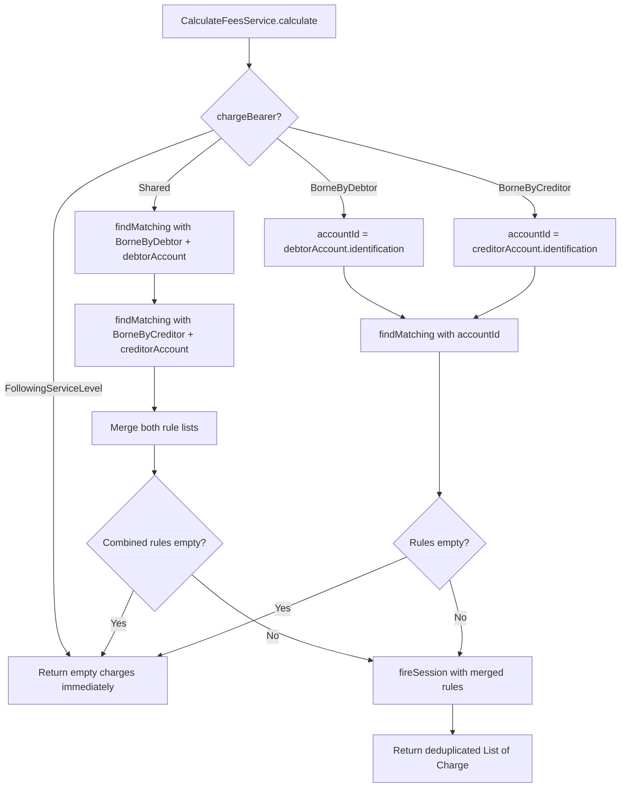

### Step Details

- **FollowingServiceLevel:** No rule lookup is performed. This bearer type signals that fees are defined by the underlying service-level agreement between the banks, not the fee engine. Returns an empty list immediately.
- **Shared — two lookups:** Two separate `findMatching` calls are issued sequentially using `BorneByDebtor` with the debtor account and `BorneByCreditor` with the creditor account. This produces two potentially distinct rule sets that are concatenated before being passed to a single Drools session. The session therefore fires debtor and creditor rules in a single `fireAllRules()` invocation.
- **BorneByDebtor:** The account identification used for the lookup is drawn from `debtorAccount.identification`. If no `debtorAccount` is supplied in the request, `Optional.empty()` is passed and the account override logic falls back to any-account rules.
- **BorneByCreditor:** Symmetric to `BorneByDebtor` using `creditorAccount.identification`.
- **Empty rules check:** Applied after every path. If the repository returns no matching rules after the account override filter, `fireSession` is never called and an empty charge list is returned directly. This avoids the overhead of creating and disposing a `KieSession` for no result.
- **fireSession:** Called once regardless of whether the bearer was `Shared`, `BorneByDebtor`, or `BorneByCreditor`. All rules are passed in together, and the result is deduplicated before returning.

---

## 3. Account-Specific Rule Override

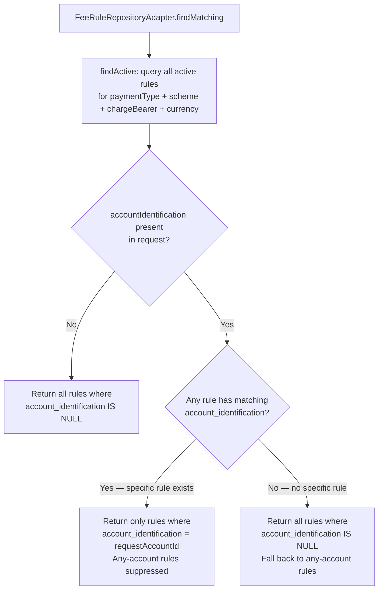

### Step Details

- **findActive query:** Executes a JPQL query filtered by `paymentType`, `scheme`, `chargeBearer`, `currency`, and `active = true`. The partial index `idx_fee_rules_lookup` covers this query. Returns **all** rows matching those four typed columns — both any-account rules (`account_identification IS NULL`) and account-specific rules.
- **No account in request:** The caller did not provide a debtor or creditor account identification. All any-account rules are returned as-is. Account-specific rules are excluded because they are irrelevant without a matching account.
- **Account present, specific rule exists:** The adapter checks whether any entity in the result set has an `account_identification` equal to the request's account identification. If at least one match is found, this signals that a targeted override rule is configured for this account. The any-account fallback rules are then suppressed — only the account-specific rule(s) are returned. This ensures per-account pricing overrides the default tariff.
- **Account present, no specific rule:** No row in the result set has a matching `account_identification`. The adapter falls back to returning all any-account rules (`account_identification IS NULL`). This is the standard path for accounts that have no bespoke fee configuration.

---

## 4. Drools Rule Evaluation

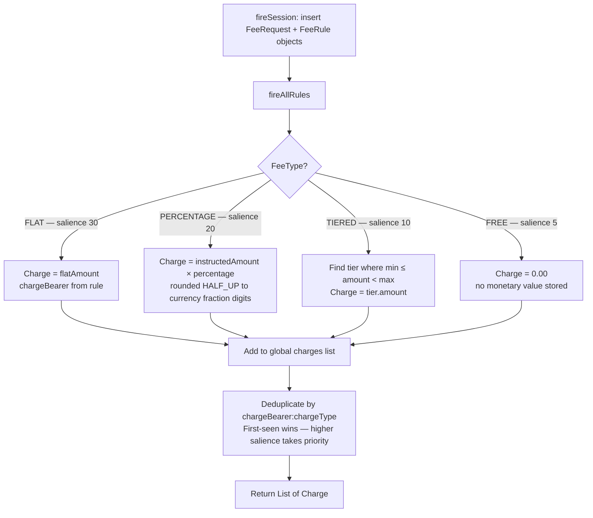

### Step Details

- **fireAllRules:** Drools evaluates all inserted `FeeRule` facts against the inserted `FeeRequest`. Rules are defined in `rules/fee-calculation.drl` on the classpath and are loaded once at startup by `KieSessionConfig`. Each rule matches on `FeeType` and fires in salience order — higher salience fires first.
- **FLAT (salience 30):** The highest-priority rule type. Charge amount equals the rule's `flatAmount` field directly. This rule fires before any other type, so a FLAT rule always wins over PERCENTAGE, TIERED, or FREE for the same `chargeType`.
- **PERCENTAGE (salience 20):** Charge amount is computed as `instructedAmount.amount × percentage`. The result is rounded `HALF_UP` to the number of fraction digits dictated by `java.util.Currency.getInstance(currency).getDefaultFractionDigits()` (e.g. 2 for GBP, 0 for JPY).
- **TIERED (salience 10):** The rule iterates the `tiers` list to find the first range where `tier.min ≤ instructedAmount.amount < tier.max`. The charge amount is that tier's fixed `amount`. If no tier matches (amount outside all defined ranges), no charge is added. Tier validity (min < max, amount > 0) is enforced at load time by `FeeRuleRepositoryAdapter.validateTiers()`.
- **FREE (salience 5):** The lowest-priority type. Produces a zero-amount `Charge` record. Used to explicitly represent "no fee" for a given charge type and bearer, distinguishing it from "no rule found".
- **Deduplication:** After `fireAllRules()`, the raw `charges` list is passed through a `LinkedHashMap<String, Charge>` keyed on `chargeBearer.name() + ':' + chargeType`. Because Drools fires higher-salience rules first, `putIfAbsent` guarantees the map retains the highest-priority result for each combination. The final `List.copyOf(seen.values())` is returned.

---

## 5. Admin: Create Fee Rule

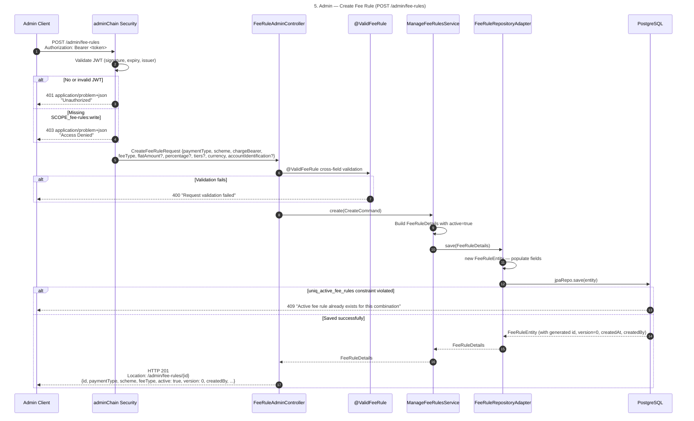

### Step Details

- **Step 1 — POST /admin/fee-rules:** Admin sends the request with an `Authorization: Bearer <token>` header. The token is a JWT issued by the OAuth2 authorisation server. Body includes `paymentType`, `scheme`, `chargeBearer` (must be `BorneByDebtor` or `BorneByCreditor`), `feeType`, fee-type-specific amount fields, `currency`, and an optional `accountIdentification` for account-specific overrides.
- **Step 2 — JWT validation:** `adminChain` uses Spring Security's OAuth2 resource server to decode and validate the JWT — checking signature, expiry, issuer, and audience. If absent or invalid, the custom `authenticationEntryPoint` writes a `ProblemDetail` response with status 401 and `Content-Type: application/problem+json`.
- **Step 3 — Scope check:** If the JWT is valid but the token claims do not include `SCOPE_fee-rules:write`, the custom `accessDeniedHandler` returns 403 with the same `application/problem+json` format.
- **Step 4 — Request deserialisation:** The request body is mapped to `CreateFeeRuleRequest`. `@Valid` triggers standard Bean Validation — required fields, size constraints, and format checks — before the controller method body runs.
- **Step 5 — @ValidFeeRule cross-field validation:** `FeeRuleRequestValidator` enforces fee-type-specific invariants: `FLAT` requires `flatAmount > 0` and no percentage/tiers; `PERCENTAGE` requires `0 < percentage ≤ 1`; `TIERED` requires at least one tier with `min < max` and `amount > 0`; `FREE` requires all amount fields to be null/absent. `chargeBearer` must be `BorneByDebtor` or `BorneByCreditor` — `Shared` and `FollowingServiceLevel` are never stored. Failures produce 400 "Request validation failed".
- **Step 6 — create(CreateCommand):** Controller maps the DTO to a `CreateCommand` record (domain-layer types) and calls `ManageFeeRulesService.create()`.
- **Step 7 — Build FeeRuleDetails:** Service constructs a `FeeRuleDetails` record with `id=null` (signals new entity to the repository) and `active=true`. New rules are always created active.
- **Step 8 — save():** Service delegates to `FeeRuleRepositoryAdapter.save()`.
- **Step 9 — Populate entity:** Adapter detects `id=null`, creates a new `FeeRuleEntity`, and sets all fields. The `tiers` list (if present) is serialised to a JSONB `JsonNode` via `ObjectMapper`.
- **Step 10 — jpaRepo.save():** Spring Data issues the `INSERT`. JPA auditing (`@CreatedDate`, `@CreatedBy`) populates `createdAt` with the current instant and `createdBy` with the JWT `sub` claim resolved by `AuditorAwareImpl`. The `@Version` column starts at 0.
- **Step 11 — Constraint violation:** If another active rule already exists for the same `(payment_type, scheme, charge_bearer, account_identification)` combination, PostgreSQL raises a unique constraint violation on `uniq_active_fee_rules`. `GlobalExceptionHandler.handleDataIntegrity()` inspects the exception message for the constraint name and returns 409 "Active fee rule already exists for this combination".
- **Step 12 — 201 Created:** On success, the controller builds a `URI` from the new rule's id for the `Location` header and returns 201 with the full `FeeRuleResponse` including the generated UUID, `version: 0`, and audit timestamps.

---

## 6. Admin: Update Fee Rule

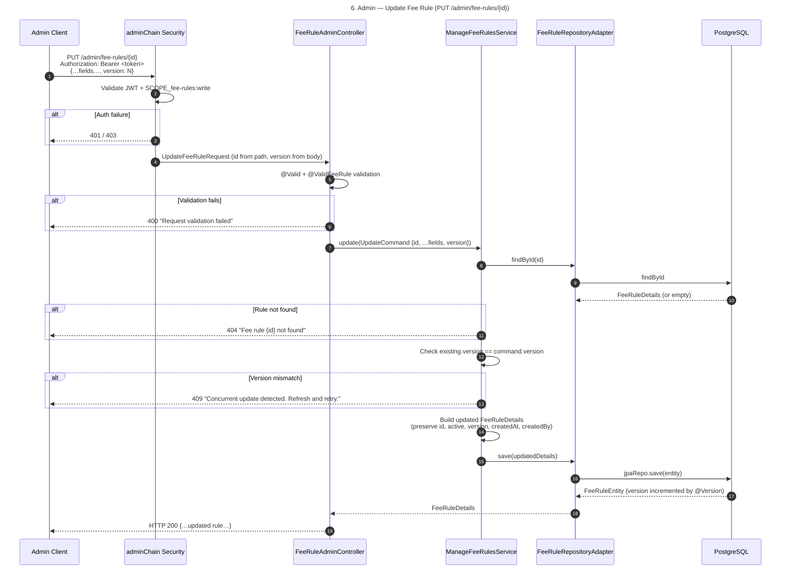

### Step Details

- **Step 1 — PUT /admin/fee-rules/{id}:** Full replacement of a fee rule's mutable fields. The `{id}` path variable identifies the rule. The request body must include a `version` field carrying the client's last known version number — this is the optimistic concurrency token.
- **Step 2 — Auth:** `adminChain` validates JWT and checks `SCOPE_fee-rules:write`. Returns 401 or 403 on failure with `application/problem+json` body.
- **Step 3 — Validation:** Same `@Valid` + `@ValidFeeRule` pipeline as create. The update request must satisfy the same fee-type-specific field rules.
- **Step 4 — update(UpdateCommand):** Controller builds an `UpdateCommand` record combining the path `id`, all body fields, and the `version`. Delegates to `ManageFeeRulesService.update()`.
- **Step 5 — findById:** Service loads the current state of the rule from the repository. This is required to retrieve fields that are not included in the update request — specifically `active`, `version`, `createdAt`, and `createdBy`.
- **Step 6 — DB lookup:** `jpaRepo.findById(id)` issues a `SELECT`. Returns `Optional<FeeRuleEntity>`.
- **Step 7 — Not found:** If the `Optional` is empty, the service throws `FeeRuleNotFoundException`. `GlobalExceptionHandler.handleNotFound()` returns 404 with the rule id in the detail message.
- **Step 8 — Optimistic lock check:** Service compares `existing.version()` with `command.version()`. This application-level check runs before the DB `UPDATE`, giving the caller a clear semantic error. Without this check, the DB `@Version` would also catch stale updates but with a less descriptive exception.
- **Step 9 — Version mismatch:** Service throws `ObjectOptimisticLockingFailureException`. `GlobalExceptionHandler.handleOptimisticLock()` returns 409 "Concurrent update detected. Refresh and retry."
- **Step 10 — Build updated details:** Service constructs a new `FeeRuleDetails` with updated mutable fields but preserves `id`, `active` flag, current `version`, `createdAt`, and `createdBy` from the existing record. The caller cannot change the active status via PUT — that is reserved for `PATCH /status`.
- **Step 11 — save():** Repository finds the entity by id (id is non-null), updates all field values in-place, and calls `jpaRepo.save(entity)`.
- **Step 12 — Version increment:** PostgreSQL increments the `@Version` column as part of the `UPDATE WHERE version = N`. The returned entity carries the new version number.
- **Steps 13–14 — 200 OK:** Updated `FeeRuleDetails` propagates back through the adapter and service to the controller. Response includes all fields with the incremented version.

---

## 7. Admin: Toggle Active Status

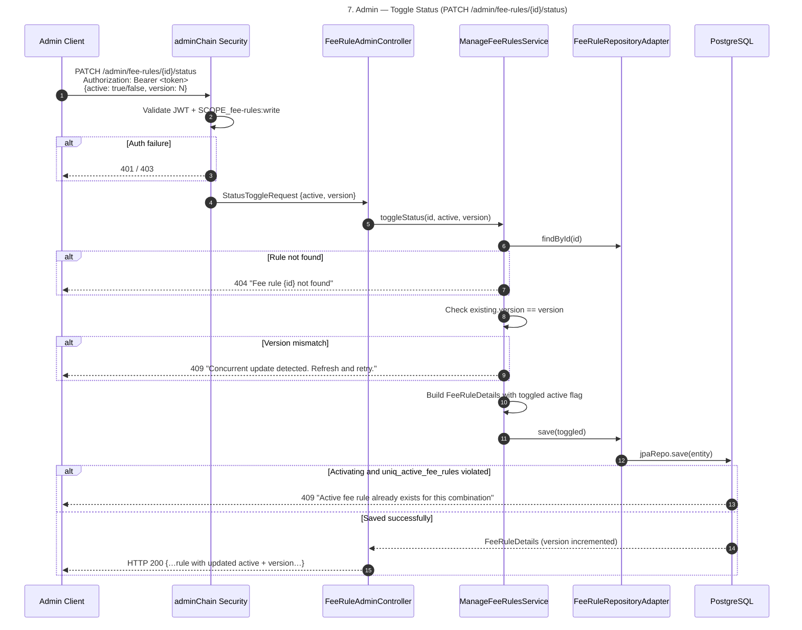

### Step Details

- **Step 1 — PATCH /admin/fee-rules/{id}/status:** A minimal patch that changes only the `active` flag. The body is a `StatusToggleRequest` containing just `active` (boolean) and `version` (long). No fee rule fields (amounts, tiers, etc.) are touched.
- **Step 2 — Auth:** `adminChain` validates JWT and checks `SCOPE_fee-rules:write`. Returns 401/403 on failure.
- **Step 3 — @Valid:** Validates that both `active` and `version` are present.
- **Step 4 — toggleStatus():** Controller calls `ManageFeeRulesService.toggleStatus(id, active, version)`. No mapper involved — the two request fields are passed directly.
- **Step 5 — findById:** Service loads the current rule to get the full picture before applying the toggle. This is also needed to verify the optimistic lock version.
- **Step 6 — Not found:** 404 if the id does not exist.
- **Step 7 — Optimistic lock check:** Version comparison identical to the update flow. Prevents two admins from simultaneously toggling the same rule without awareness of each other's changes.
- **Step 8 — Build toggled details:** Service reconstructs the `FeeRuleDetails` record with all existing fields preserved and only the `active` flag changed to the requested value.
- **Step 9 — save():** Repository updates the entity in the DB.
- **Step 10 — uniq_active_fee_rules on re-activation:** When toggling from inactive to active (`active=true`), the DB evaluates the unique partial index. If another active rule already covers the same `(payment_type, scheme, charge_bearer, account_identification)`, PostgreSQL rejects the `UPDATE` with a constraint violation → `GlobalExceptionHandler` returns 409. Deactivation (`active=false`) never violates this constraint.
- **Step 11 — 200 OK:** The DB increments `@Version`. The updated rule — with the new `active` flag and incremented version — is returned in the 200 response. The caller must use this new version for any subsequent mutation.

---

## 8. Admin: Dry-Run Fee Preview

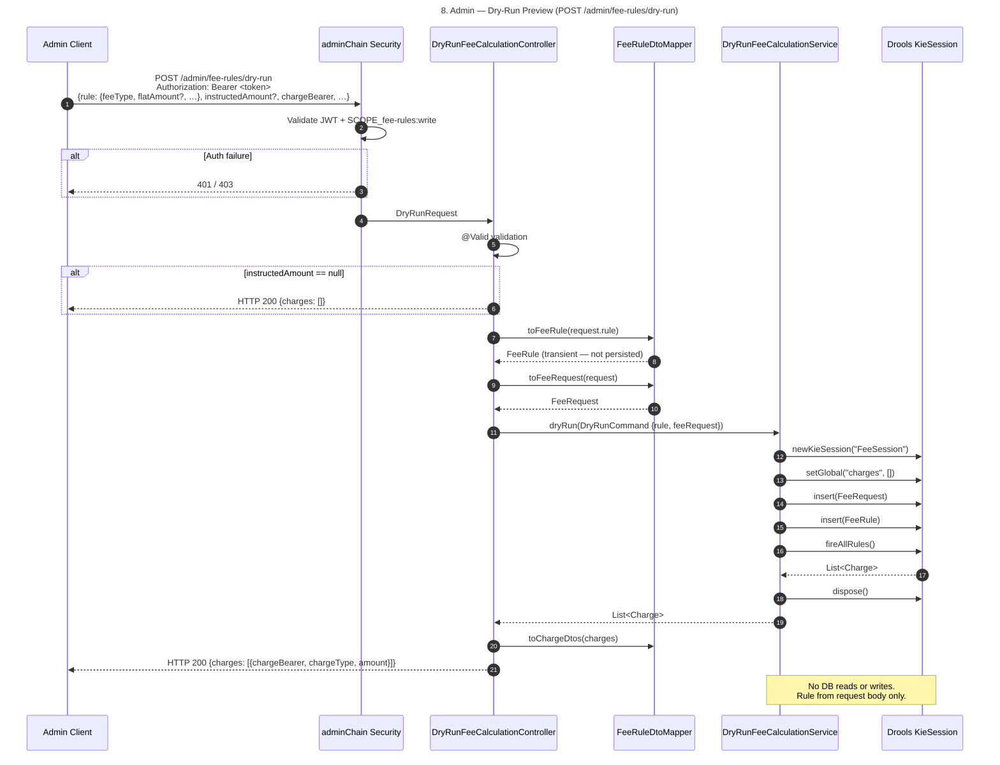

### Step Details

- **Step 1 — POST /admin/fee-rules/dry-run:** Admin submits a rule definition alongside payment context to preview what charges the rule would produce without saving it. The body contains an embedded `rule` object (with `feeType`, amounts, etc.) and the payment attributes (`instructedAmount`, `chargeBearer`, optional accounts).
- **Step 2 — Auth:** `adminChain` validates JWT and checks `SCOPE_fee-rules:write`. Even though nothing is persisted, write scope is required because the caller is evaluating rule configurations in the admin namespace.
- **Step 3 — @Valid:** Standard Bean Validation on the request body.
- **Step 4 — instructedAmount null short-circuit:** If `instructedAmount` is absent, the controller returns an empty `DryRunResponse` immediately. No `FeeRule` is constructed and no Drools session is opened, because charge calculations require an amount to work against.
- **Step 5 — toFeeRule():** `FeeRuleDtoMapper` converts the embedded rule DTO into a domain `FeeRule` object. This is a pure in-memory mapping — no DB interaction. The resulting `FeeRule` is transient and will never be persisted.
- **Step 6 — toFeeRequest():** Mapper builds a `FeeRequest` fact from the payment attributes in the `DryRunRequest`. This is the same `FeeRequest` type used by the regular calculation flow.
- **Step 7 — dryRun(DryRunCommand):** Controller wraps the `FeeRule` and `FeeRequest` into a `DryRunCommand` record and delegates to `DryRunFeeCalculationService`.
- **Steps 8–11 — Drools session:** Service opens a fresh `KieSession("FeeSession")`, sets the `charges` global, inserts the `FeeRequest` and the single transient `FeeRule` as facts, and calls `fireAllRules()`. This is the same Drools mechanics as the regular calculation path.
- **Step 12 — Session dispose:** Session is always disposed in a `finally` block regardless of whether rules fired or an exception occurred.
- **Step 13 — No deduplication:** Unlike the regular flow, only a single rule is inserted, so duplicate `chargeType` entries cannot arise. The raw `charges` list is returned as-is.
- **Step 14 — 200 OK:** `toChargeDtos()` maps `Charge` domain objects to response DTOs. The response shows exactly what charges this rule would produce for the given payment — with zero side effects on the database.

---

## 9. Admin: List and Get Fee Rules

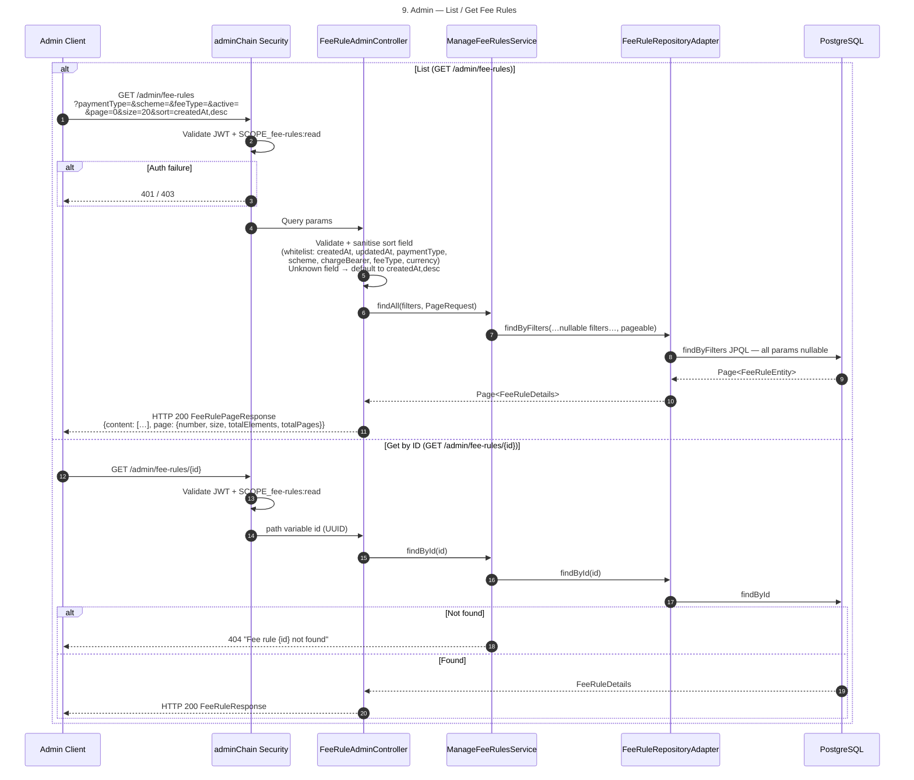

### Step Details

#### List — GET /admin/fee-rules

- **Step 1 — Request:** Client sends a GET with optional query parameters. All six filter dimensions (`paymentType`, `scheme`, `chargeBearer`, `feeType`, `currency`, `accountIdentification`, `active`) are independently optional and can be combined freely. Pagination defaults: `page=0`, `size=20`. Sort defaults: `createdAt,desc`.
- **Step 2 — Auth:** `adminChain` validates JWT and checks `SCOPE_fee-rules:read`. GET operations require read scope only.
- **Step 3 — Sort sanitisation:** The `sort` parameter is split on `,` to extract a field name and direction. The field name is stripped of any leading `+` or `-` prefix, then checked against the hardcoded `ALLOWED_SORT_FIELDS` whitelist (`createdAt`, `updatedAt`, `paymentType`, `scheme`, `chargeBearer`, `feeType`, `currency`). An unrecognised field silently falls back to `createdAt` — this prevents callers from injecting arbitrary column names into the JPQL `ORDER BY` clause.
- **Step 4 — findAll():** Controller builds a Spring Data `PageRequest` with the sanitised sort and calls `ManageFeeRulesService.findAll()` passing all filter values (null for omitted parameters).
- **Step 5 — findByFilters JPQL:** The repository executes a JPQL query where every filter clause is guarded by `:param IS NULL OR f.field = :param`. This makes the query act as a dynamic multi-dimensional filter — only the supplied parameters narrow the result set.
- **Step 6 — Pagination:** Spring Data appends `LIMIT` / `OFFSET` and executes a separate `COUNT` query. Returns a `Page<FeeRuleEntity>`.
- **Step 7 — FeeRulePageResponse:** The `Page<FeeRuleDetails>` is wrapped in `FeeRulePageResponse.from()` which includes a nested `page` metadata object with `number`, `size`, `totalElements`, and `totalPages`.

#### Get by ID — GET /admin/fee-rules/{id}

- **Step 1 — Request:** Client supplies the rule's UUID as a path variable.
- **Step 2 — Auth:** `adminChain` validates JWT + `SCOPE_fee-rules:read`.
- **Step 3 — findById():** Controller delegates directly to `ManageFeeRulesService.findById(id)`.
- **Step 4 — DB lookup:** Repository calls `jpaRepo.findById(id)`. Returns `Optional<FeeRuleEntity>`.
- **Step 5 — Not found:** If empty, service throws `FeeRuleNotFoundException` → 404 with the id in the detail message.
- **Step 6 — 200 OK:** `FeeRuleResponse` includes all fields: mutable rule attributes, `active`, `version`, and the four JPA audit fields (`createdAt`, `createdBy`, `updatedAt`, `updatedBy`).

---

## 10. Full Admin Lifecycle — Create, Update, Toggle, Delete

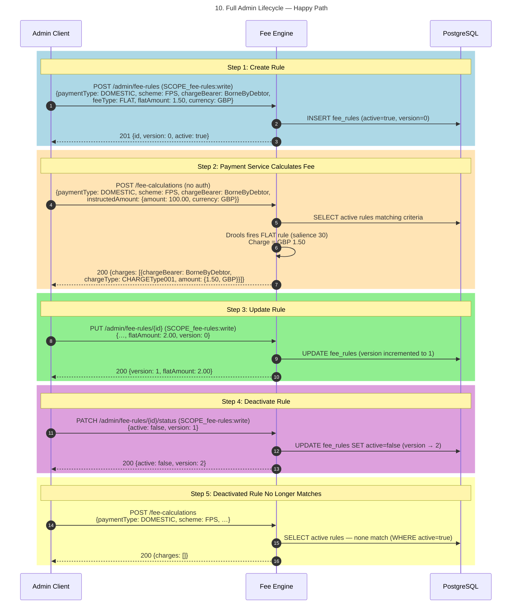

### Step Details

- **Step 1 — Create Rule (blue):** A new `DOMESTIC/FPS/BorneByDebtor/FLAT` rule is created with `flatAmount: 1.50 GBP`. The service inserts the row with `active=true`, `version=0`, and JPA-audited timestamps. The response includes the generated UUID and a `Location` header for subsequent lookups.
- **Step 2 — Fee Calculation (orange):** A payment service (not the admin client) calls `POST /fee-calculations` without authentication for a matching domestic FPS payment. The engine queries the `idx_fee_rules_lookup` partial index (`WHERE active = TRUE`), finds the FLAT rule, opens a Drools session, and the FLAT rule fires at salience 30 producing a GBP 1.50 charge. The charge is returned with `chargeBearer`, `chargeType`, and `amount`.
- **Step 3 — Update Rule (green):** Admin increases the flat amount to 2.00 GBP. The `PUT` body includes `version: 0` — the version from Step 1's response. The service performs the optimistic-lock check (0 == 0, passes), updates the entity, and the DB increments the version to 1. Subsequent fee calculations now return GBP 2.00.
- **Step 4 — Deactivate Rule (purple):** Admin sends `PATCH /status` with `active: false` and `version: 1`. The service verifies version (1 == 1, passes) and sets `active=false`. Version increments to 2. The rule is now excluded from the `findActive` query.
- **Step 5 — No Match After Deactivation (yellow):** A subsequent `POST /fee-calculations` for the same combination returns an empty charge list. The `findActive` JPQL query (`WHERE active = TRUE`) no longer matches the deactivated rule. No Drools session is opened.

---

## State Machine: Fee Rule Active Status

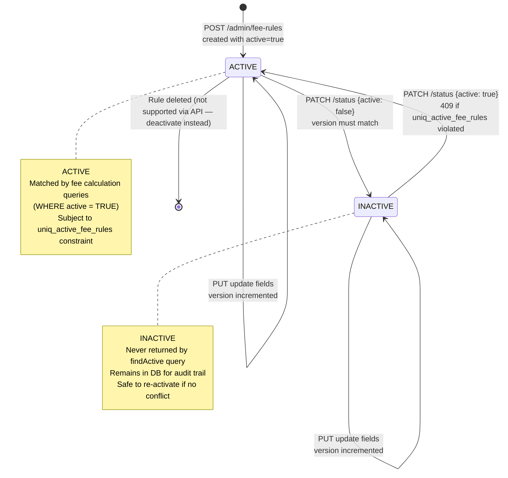

### State Details

- **Initial → ACTIVE:** All rules are created in the `ACTIVE` state (`active=true`). The `uniq_active_fee_rules` constraint is evaluated at creation time — if another active rule already covers the same `(payment_type, scheme, charge_bearer, account_identification)`, the `INSERT` fails with 409.
- **ACTIVE:** The rule is included in fee calculation lookups via `idx_fee_rules_lookup` (`WHERE active = TRUE`). The rule is subject to the uniqueness constraint — no two active rules may share the same combination. Field updates via `PUT` keep the rule active and increment the version on each change.
- **ACTIVE → INACTIVE:** Triggered by `PATCH /status {active: false}`. The version in the request must match the DB version (optimistic lock). On success, the `active` flag is set to `false` and the version increments. The rule is immediately excluded from all fee calculation queries but remains in the database.
- **INACTIVE:** The rule is invisible to `findActive` queries, so it has no effect on fee calculations. Field updates via `PUT` are still permitted while inactive — this allows rules to be edited before being re-activated. The uniqueness constraint does not apply to inactive rules, so multiple inactive rules may share the same combination.
- **INACTIVE → ACTIVE:** Triggered by `PATCH /status {active: true}`. Subject to the same `uniq_active_fee_rules` constraint as creation — re-activation fails with 409 if another active rule already claims the same combination. On success the version increments.
- **No DELETE endpoint:** There is no API endpoint to permanently delete a rule. Inactive rules are retained in the database for audit trail and historical reporting purposes.

---

## Security Filter Chains

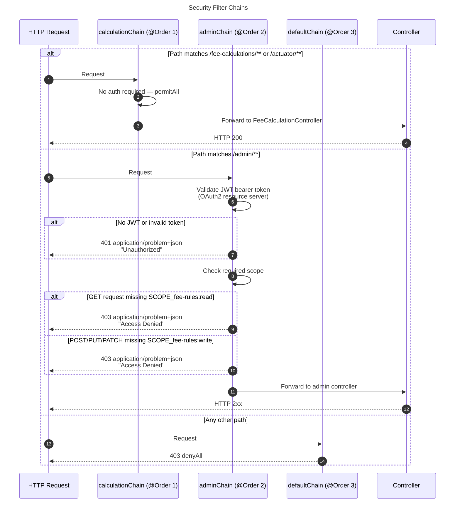

### Step Details

- **Step 1 — calculationChain (@Order 1):** Matches `/fee-calculations/**` and `/actuator/**`. Session management is stateless (no HTTP session created). CSRF is disabled (stateless API). `permitAll()` means any request — authenticated or not — is forwarded to the controller. Evaluated first due to `@Order(1)`. Internal payment services call this path without any token.
- **Step 2 — adminChain (@Order 2):** Matches `/admin/**`. Also stateless with CSRF disabled. Configures Spring Security as an OAuth2 resource server, which wires in a `JwtDecoder` bean to validate incoming bearer tokens. The decoder checks the JWT signature (using the authorisation server's JWKS), `exp` claim (expiry), and `iss` claim (issuer). If no `Authorization` header is present or the token is malformed/expired, the custom `authenticationEntryPoint` writes a `ProblemDetail` with status 401 and `Content-Type: application/problem+json`.
- **Step 3 — Scope enforcement:** After successful JWT validation, Spring Security extracts the `scope` claim and converts each scope to a `GrantedAuthority` with a `SCOPE_` prefix (e.g. `"fee-rules:read"` → `"SCOPE_fee-rules:read"`). The chain's authorisation rules require `SCOPE_fee-rules:read` for GET methods and `SCOPE_fee-rules:write` for POST, PUT, and PATCH. If the token is valid but lacks the required scope, the custom `accessDeniedHandler` returns 403 with `application/problem+json`.
- **Step 4 — defaultChain (@Order 3):** Catch-all for any path not claimed by chains 1 or 2 (e.g. `/foo`). `denyAll()` rejects every request with 403. This prevents accidental exposure of unmapped endpoints.

---

## Error Responses

```mermaid
flowchart TD
    A[Inbound request] --> B{Security check}
    B -->|No/invalid JWT on /admin/**| C[401 Unauthorized]
    B -->|Wrong scope on /admin/**| D[403 Access Denied]
    B -->|Auth OK or /fee-calculations| E{Bean validation}
    E -->|@Valid fails: missing/wrong field| F[400 Request validation failed]
    E -->|@ValidFeeRule fails: fee-type mismatch| F
    E -->|Valid| G{Business logic}
    G -->|Rule not found| H[404 Fee rule id not found]
    G -->|version mismatch in update/toggle| I[409 Concurrent update detected]
    G -->|uniq_active_fee_rules on create/activate| J[409 Active fee rule already exists]
    G -->|Unknown currency code| K[400 Invalid request parameter value]
    G -->|Corrupt tier data in DB| L[500 Fee calculation failed due to invalid rule configuration]
    G -->|Success| M[200 / 201]
```

### Node Details

- **Security check — 401:** `authenticationEntryPoint` fires when the request carries no `Authorization` header, a malformed token, an expired token, or a token with an unrecognised signature. Response body is `application/problem+json` with `status: 401` and `detail: "Unauthorized"`.
- **Security check — 403:** `accessDeniedHandler` fires when the JWT is valid but the token's scopes do not include the required authority for the HTTP method. Response body is `application/problem+json` with `status: 403` and `detail: "Access Denied"`.
- **@Valid — 400:** Standard Bean Validation triggered by `@Valid` on controller parameters. Catches missing required fields, null values, and format violations. Handled by `GlobalExceptionHandler.handleValidation()`.
- **@ValidFeeRule — 400:** Custom constraint `FeeRuleRequestValidator` enforces cross-field fee-type rules. `FLAT` must have `flatAmount > 0`; `PERCENTAGE` must have `0 < percentage ≤ 1`; `TIERED` must have non-empty tiers with `min < max` and `amount > 0`; `FREE` must have no amount fields. Also enforces `chargeBearer ∈ {BorneByDebtor, BorneByCreditor}`. Produces the same 400 response as `@Valid`.
- **404 — FeeRuleNotFoundException:** Thrown by `ManageFeeRulesService` in `findById`, `update`, and `toggleStatus` when `findById` returns empty. `GlobalExceptionHandler.handleNotFound()` returns `status: 404` with the rule UUID in the detail string.
- **409 — Concurrent update:** `ObjectOptimisticLockingFailureException` thrown by the service layer when the request's `version` field does not match the current DB version. Handled by `GlobalExceptionHandler.handleOptimisticLock()`. The caller must re-fetch the rule and retry with the current version.
- **409 — Duplicate active rule:** `DataIntegrityViolationException` from PostgreSQL `uniq_active_fee_rules` constraint violation. `GlobalExceptionHandler.handleDataIntegrity()` checks the exception message for the constraint name and returns a specific 409 detail. Any other `DataIntegrityViolationException` falls through to a generic 400.
- **400 — Unknown currency code:** `IllegalArgumentException` thrown by `java.util.Currency.getInstance(currency)` in `CalculateFeesService` when the currency string is not a valid ISO 4217 code. Handled by `GlobalExceptionHandler.handleIllegalArgument()`.
- **500 — Corrupt tier data:** `IllegalStateException` thrown by `FeeRuleRepositoryAdapter.validateTiers()` when JSONB tier data in the database is structurally invalid (e.g. a stored tier has `min >= max` or a null amount). This is a data integrity problem in the DB, not a user error. Handled by `GlobalExceptionHandler.handleIllegalState()`.

---

## Legend

| Symbol | Meaning |
|--------|---------|
| `ACTIVE` | Rule matched by fee calculation queries (`WHERE active = TRUE`) |
| `INACTIVE` | Rule excluded from all lookups; preserved for audit |
| `FeeRule` | Domain object passed to Drools — immutable, not persisted directly |
| `FeeRuleDetails` | Application-layer record bridging persistence ↔ use cases |
| `FeeRequest` | Drools fact representing the inbound payment request |
| `Charge` | Drools output — one per matching rule after deduplication |
| `KieSession` | Drools stateful session; always disposed after use |
| `DryRun` | Rule evaluated against a payment without being saved to DB |

### Security Scopes

| Scope | Permitted operations |
|-------|---------------------|
| `SCOPE_fee-rules:read` | GET /admin/fee-rules, GET /admin/fee-rules/{id} |
| `SCOPE_fee-rules:write` | POST, PUT, PATCH on /admin/fee-rules; POST /admin/fee-rules/dry-run |
| *(none required)* | POST /fee-calculations, /actuator/** |

### Drools Salience Order

| Salience | FeeType | Charge calculation |
|----------|---------|-------------------|
| 30 | `FLAT` | Fixed `flatAmount` |
| 20 | `PERCENTAGE` | `instructedAmount × percentage`, rounded `HALF_UP` |
| 10 | `TIERED` | `tier.amount` for first matching range (`min ≤ amount < max`) |
| 5 | `FREE` | Zero-amount charge |

### Key Constraints

| Constraint | Behaviour |
|-----------|-----------|
| `uniq_active_fee_rules` | At most one active rule per `(payment_type, scheme, charge_bearer, account_identification)` — HTTP 409 on violation |
| `chk_free_no_amount` | `FREE` fee type must have null `flat_amount`, `percentage`, and `tiers` — enforced via `NOT VALID` (V2) + `VALIDATE` (V3) |
| `chk_charge_bearer` | Only `BorneByDebtor` / `BorneByCreditor` stored; `Shared` and `FollowingServiceLevel` handled in application layer |
